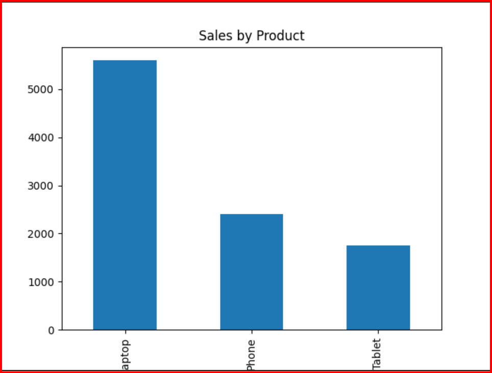
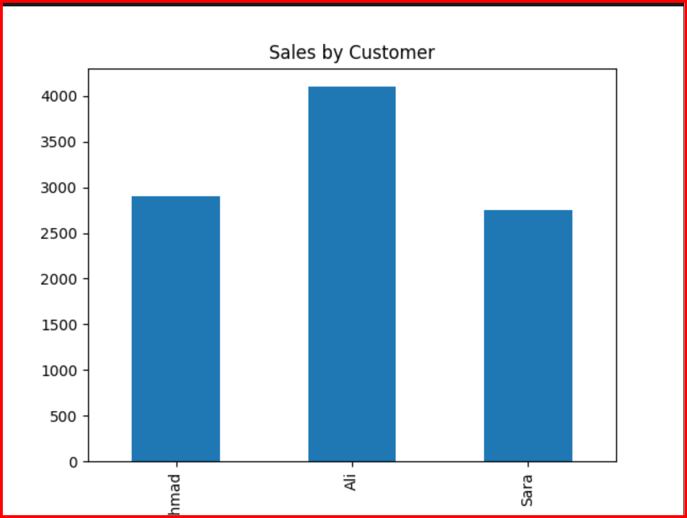

# 📊 Customer Sales Analysis Project

## 🚀 Overview

This project analyzes customer purchasing behavior and product performance to generate meaningful business insights.

It demonstrates a real-world data analysis workflow using Python, pandas, and matplotlib.

---

## 📁 Dataset

The dataset contains sales records with the following fields:

* Customer → Name of customer
* Product → Product purchased
* Sales → Revenue generated

---

## 🛠️ Tools & Technologies

* Python
* pandas
* matplotlib

---

## 🔍 Analysis Performed

### 1. Data Cleaning

* Removed duplicates
* Handled missing values
* Reset index

### 2. Revenue Analysis

* Calculated total revenue
* Analyzed revenue by product
* Analyzed revenue by customer

### 3. Performance Insights

* Identified top customer
* Identified best-performing product

---

## 📊 Key Results

* 💰 **Total Revenue:** 9,750
* 🏆 **Top Customer:** Ali
* 📦 **Best Product:** Laptop

---

## 📈 Visualizations

### Product Sales


### Customer Sales


---

## 🧠 Business Insights

1. Ali is the highest-value customer, contributing the most revenue.
2. Laptop is the dominant product, generating the majority of sales.
3. Tablet is the lowest-performing product, indicating weaker demand.
4. Customers purchase multiple products, showing effective cross-selling.
5. Revenue is highly dependent on a single customer and product, posing potential business risk.

---

## 📂 Project Structure

```
day47_customer_sales_analysis/
│
├── analysis.py
├── customer_sales.csv
├── insights.txt
├── README.md
```

---

## 🎯 Conclusion

This project demonstrates how customer-level data can be transformed into actionable business insights using data analysis techniques.

---

## 📌 Author

**Saud Khan**
Aspiring Data Analyst | Python & Data Analysis
"Beyond the Universe"
